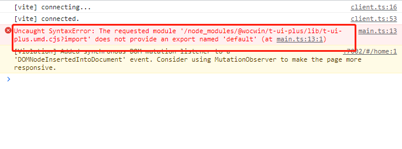

### 快速上手

::: tip 提示

aura-ui 基于 vue3 + ts + Element-plus 再次封装的基础组件

:::

### 安装

**建议您使用包管理器 ([pnpm](https://pnpm.io/)<el-tag  effect="dark">推荐</el-tag> ， [yarn](https://classic.yarnpkg.com/lang/en/)，[npm](https://www.npmjs.com/)) 安装 aura-ui**。

::: code-group

```sh [pnpm]
pnpm install aura-ui -S
```

```sh [yarn]
yarn add aura-ui
```

```sh [npm]
npm install aura-ui    -S
```

:::

### 全局使用

> #### 前提条件：使用项目必须全局注册 Element-plus 组件库

```js
// main.ts
import { createApp } from "vue"
import App from "./App.vue"
import ElementPlus from "element-plus"
import "element-plus/dist/index.css"
import "element-plus/theme-chalk/dark/css-vars.css"
import locale from "element-plus/es/locale/lang/zh-cn"
// element-plus图标
import * as ElementPlusIconsVue from "@element-plus/icons-vue"

import AuraUI from "aura-ui"

import "aura-ui/lib/style.css"
const app = createApp(App)
// 注册所有图标
for (const [key, component] of Object.entries(ElementPlusIconsVue)) {
  app.component(key, component)
}
// 注册ElementPlus
app.use(ElementPlus, {
  locale // 语言设置
  // size: Cookies.get('size') || 'medium' // 尺寸设置
})
app.use(AuraUI)
app.mount("#app")
```

### 按需引入

```js
// 在main.js中按下引入
import "aura-ui/lib/style.css"
// 单个.vue文件引入
;<script setup lang="ts">
  import {(AuDetail, AuForm)} from "aura-ui"
</script>
```

### Use CDN in Project--建议使用 pnpm 安装使用

> 浏览器直接引入组件库，属性`驼峰命名`必须转换为短横线，直接通过浏览器的 HTML 标签导入 `aura-ui`，然后就可以使用全局变量 `AuraUI` 了。

```html
<head>
  <!-- Import style -->
  <link rel="stylesheet" href="https://unpkg.com/element-plus/dist/index.css" />
  <link rel="stylesheet" href="https://unpkg.com/@wocwin/t-ui-plus/lib/style.css" />
  <!-- Import Vue 3 -->
  <script src="https://unpkg.com/vue@3"></script>
  <!-- Import component library -->
  <script src="https://unpkg.com/element-plus"></script>
  <!-- 3. 引入t-ui-plus的组件库 -->
  <script src="https://unpkg.com/@wocwin/t-ui-plus@latest"></script>
</head>
<body>
  <div id="app">
    <au-input
      placeholder="请输入金额"
      input-type="amount"
      show-thousands
      v-model="value"
    ></au-input>
  </div>
  <script>
    const app = Vue.createApp({
      data() {
        return {
          value: ""
        }
      }
    })
    app.mount("#app")
  </script>
</body>
```

### 全部组件如下

| 组件名称                  | 说明                                                                                                                                                           |
| :------------------------ | :------------------------------------------------------------------------------------------------------------------------------------------------------------- |
| AuLayoutPage              | 布局页面                                                                                                                                                       |
| AuLayoutPageItem          | 布局页面子项                                                                                                                                                   |
| AuAdaptivePage            | [一屏组件](https://wocwin.github.io/t-ui-plus/components/AuAdaptivePage/base.html?_blank)（继承 AuTable 及 AuQueryCondition 组件的所有属性、事件、插槽、方法） |
| AuQueryCondition          | [条件查询组件](https://wocwin.github.io/t-ui-plus/components/AuQueryCondition/base.html?_blank)                                                                |
| AuTable                   | [表格组件](https://wocwin.github.io/t-ui-plus/components/AuTable/base.html?_blank)                                                                             |
| Virtualized AuTable       | [虚拟列表](https://wocwin.github.io/t-ui-plus/components/AuTableVirtual/base.html?_blank)                                                                      |
| AuForm                    | [表单组件](https://wocwin.github.io/t-ui-plus/components/AuForm/base.html?_blank)                                                                              |
| AuSelectTable             | [下拉选择表格组件](https://wocwin.github.io/t-ui-plus/components/AuSelectTable/base.html?_blank)                                                               |
| Virtualized AuSelectTable | [下拉选择虚拟表格组件](https://wocwin.github.io/t-ui-plus/components/multipleVirtual/base.html?_blank)                                                         |
| AuSelectIcon              | [图标选择组件](https://wocwin.github.io/t-ui-plus/components/AuSelectIcon/base.html?_blank)                                                                    |
| AuSelect                  | [下拉选择组件](https://wocwin.github.io/t-ui-plus/components/AuSelect/base.html?_blank)                                                                        |
| AuDetail                  | [详情组件](https://wocwin.github.io/t-ui-plus/components/AuDetail/base.html?_blank)                                                                            |
| AuButton                  | [防抖按钮组件](https://wocwin.github.io/t-ui-plus/components/AuButton/base.html?_blank)                                                                        |
| AuStepWizard              | [步骤条组件](https://wocwin.github.io/t-ui-plus/components/AuStepWizard/base.html?_blank)                                                                      |
| AuTimerBtn                | 定时按钮组件                                                                                                                                                   |
| AuModuleForm              | [模块表单/详情组件](https://wocwin.github.io/t-ui-plus/components/AuModuleForm/base.html?_blank)                                                               |
| AuDatePicker              | [日期选择器组件](https://wocwin.github.io/t-ui-plus/components/AuDatePicker/base.html?_blank)                                                                  |
| AuRadio                   | [单选组件](https://wocwin.github.io/t-ui-plus/components/AuRadio/base.html?_blank)                                                                             |
| AuCheckbox                | [多选组件](https://wocwin.github.io/t-ui-plus/components/AuCheckbox/base.html?_blank)                                                                          |
| AuChart                   | [图表组件](https://wocwin.github.io/t-ui-plus/components/AuChart/base.html?_blank)                                                                             |
| AuTabs                    | [标签页组件](https://wocwin.github.io/t-ui-plus/components/AuTabs/base.html?_blank)                                                                            |
| AuSelectIcon              | [图标选择组件](https://wocwin.github.io/t-ui-plus/components/AuSelectIcon/base.html?_blank)                                                                    |
| AuDrawer                  | 侧滑抽屉组件，适用于详情与编辑表单面板                                                                                                                         |
| AuBreadcrumb              | 面包屑组件，支持自动路由与手动配置                                                                                                                             |
| AuQueryTable              | 查询表格复合组件，内置查询与表格联动                                                                                                                           |
| AuMenu                    | 导航菜单组件，支持多级菜单与权限过滤                                                                                                                           |

### AuraUI 组件 Volar 类型提示

```js
// 需要在使用的项目的tsconfig.json文件中添加以下
compilerOptions：{
  "types": [
      "aura-ui/components.d.ts",
    ],
}

```

### 🔨 Vue3 + Vite 项目中安装引入报如下错误的解决方法

> #### 把项目的 vite 版本升级到 4+



### docs 文档结构目录

```
├─ examples               # VPDemo组件自动解析此文件夹下的所有.vue文件
├─ components             # .md文件
├─ public                 # 静态资源文件
├─ .vitepress
│  ├─ config              # 插件配置
|  │  ├─ global.ts        # 全局变量定义
|  │  └─ plugins.ts       # 自定义.md文件渲染
│  ├─ theme               # 主题配置
│  ├─ utils               # 文档展开隐藏代码高亮
│  ├─ vitepress
|  │  ├─ vp-demo          # VPDemo组件源码
|  │  ├─ style            # VPDemo组件样式
|  │  └─ index.ts         # 暴露VPDemo组件
│  └─ config.ts           # vitepress配置文件
├─ index.md               # 文档home页面
├─ tsconfig.json          # typescript 全局配置
└─ vite.config.ts         # vite 全局配置文件（支持tsx）
```

### Git 提交规范（PR 提交规范）

- `ci`: ci 配置文件和脚本的变动;
- `chore`: 构建系统或辅助工具的变动;
- `fix`: 代码 BUG 修复;
- `feat`: 新功能;
- `perf`: 性能优化和提升;
- `refactor`: 仅仅是代码变动，既不是修复 BUG 也不是引入新功能;
- `style`: 代码格式调整，可能是空格、分号、缩进等等;
- `docs`: 文档变动;
- `test`: 补充缺失的测试用例或者修正现有的测试用例;
- `revert`: 回滚操作;

### vue2 基础组件

> 基于 vue2 + Element-ui 和 ant-design-vue 二次封装的基础组件

---

#### [Vue2 基础组件文档地址](https://wocwin.github.io/t-ui/)

---

#### [Vue2 基础组件码云地址](https://gitee.com/wocwin/t-ui)

---

#### [Vue2 基础组件 GitHub 地址](https://github.com/wocwin/t-ui)
